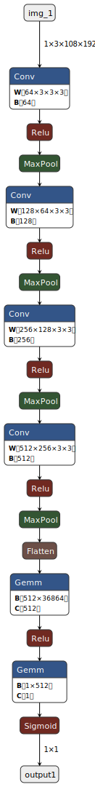

# ISeeYou Model - Boat-MNIST Classification

## Overview

ISeeYou is a neural network model designed for binary image classification using the Boat-MNIST dataset. This dataset provides a simple hands-on benchmark to test small neural networks on the task of distinguishing between images containing watercraft and other images.

## Boat-MNIST Dataset

The Boat-MNIST dataset consists of two classes:
1. **Class 1**: Images containing any watercraft instance (boats, ships, surfboards, etc.) on the water.
2. **Class 0**: All other images, including just water or anything on the land (which may also include boats).

This dataset includes edge cases, such as boats at the verge of the water and the shore.

### Metrics

- **Prediction Accuracy**: Number of correctly predicted images divided by the total number of images.
- **Model Parameters**: The total number of parameters in the model.

## Contents

- `models/iseeyou.onnx`: The ONNX file of the trained model. [Download here](https://drive.google.com/file/d/your-file-id/view?usp=sharing)
- `iseeyou.onnx.svg`: A screenshot of the neural network architecture.

## Training Details

- **Training Time**: Approximately 12 minutes
- **Hardware**: 28 GPUs
- **Software**: CUDA 12.1

### Visualizing the Model

You can find a visual representation of the neural network architecture in the `iseeyou.onnx.svg` file.

## License

This project is licensed under the MIT License - see the [LICENSE](LICENSE) file for details.

## Acknowledgements

Special thanks to everyone who contributed to the development and training of this model. The Boat-MNIST dataset and starter code were obtained from the [[Maritime Computer Vision Initiative](https://macvi.org/dataset)].
